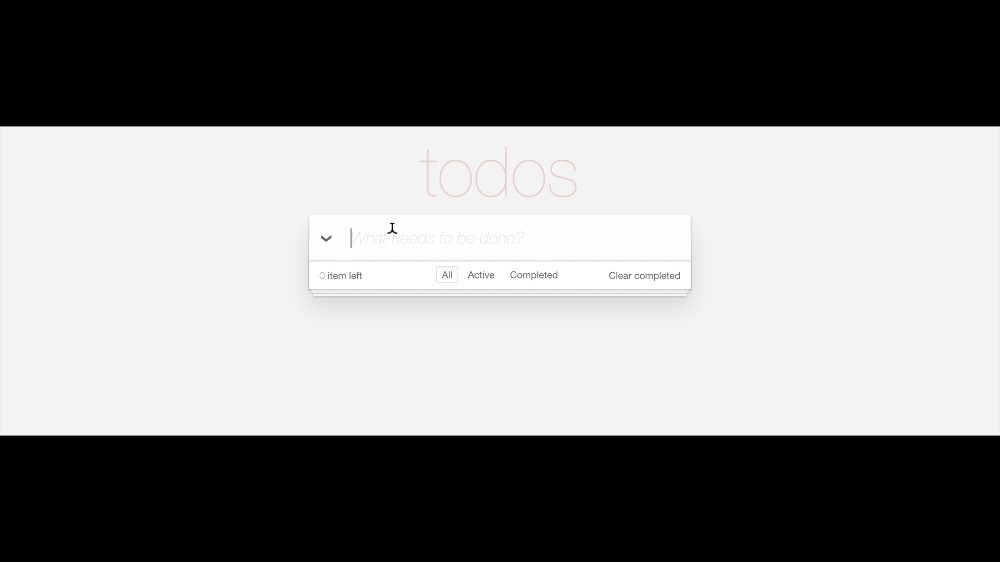

# react-todo 

> Todo App based on [Andrew Van Slaars course on Egghead](https://egghead.io/courses/build-your-first-production-quality-react-app) and in the [TodoMVC](todomvc.com)

## Usage

1) Open a terminal to start `json-server` in the project directory:

`$ json-server -p 8080 --watch db.json`

> Yes, the port *should* be 8080. Change it in the `todoService.js` file if you want to

2) Run the app

`$ yarn start`

3) Have fun!

## Presentation

## Dependencies

- [react and react-dom](https://github.com/facebook/react)
- [react-scripts](https://github.com/facebookincubator/create-react-app)
- [prop-types](https://github.com/facebook/prop-types)
- [react-auto-binder](https://github.com/helton/react-auto-binder)
- [react-notification-system](https://github.com/igorprado/react-notification-system)

## License

 © [Helton Carlos de Souza](http://helton.me)

